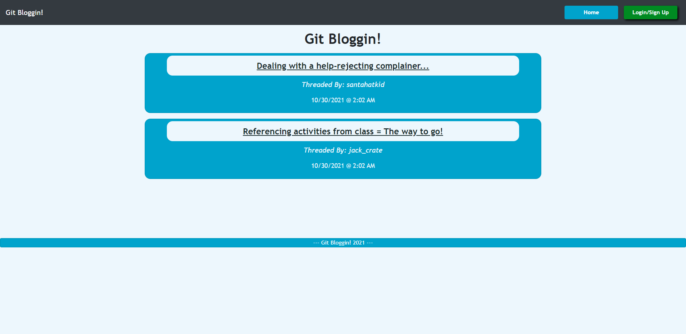
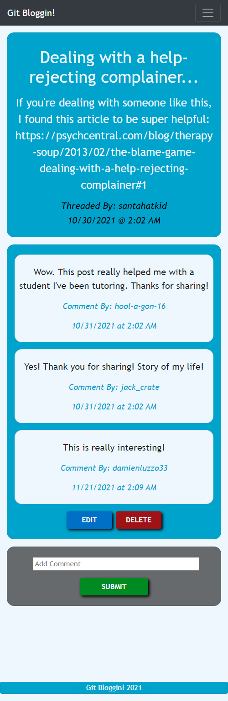

# Git Bloggin

## Description

[Deployed Application](https://git-bloggin.herokuapp.com/)

Messaging forums and blogs have gone mainstream. In today's world, it's tough to find an internet user who doesn't read or contribute to a forum or blog. When we're talking about the world of coding and computer science, it's even more rare to find a software developer who doesn't utilize the resources of something like reddit or stack overflow. Git Bloggin was created to provide developers with a new place to ask questions, get answers, create tutorials, etc, without the extra bells and whistles that clutter up popular landing pages like stack overflow.

Tired of outdated posts? Not interested in all the extraneous things that stack overflow and reddit force upon you? Ready to level up your coding knowledge and build community with fellow devs? Then Git Bloggin is the blog space for you! Get the support you seek with a simple and easy to user interface to quench your blogging and forum needs. Git Bloggin let's you post, edit, and delete threads and comments, while giving you a clean UI comparable to reddit (if reddit ever decided to add more colors to their webpage).

If you are interested in improving or modifying this application for your own personal usage, please go ahead and clone down the repository and transform it into your own amazing Forum or Blogging Website!

[Link to video demo of app](https://drive.google.com/file/d/1bi82jAaHpahCg91TxA7y30aj6ksFjUrC/view?usp=sharing)

## Table of Contents

- [Installation](#installation)
- [Usage](#usage)
- [Credits](#credits)
- [License](#license)
- [Features](#features)
- [Examples/Tests](#examples)

## Installation

- While this application is already hosted and running on Heroku, you can alternatively clone this repository down to your local machine and connect the application to your local MySQL database.

## Usage

- To user the app, simply click the link to the deployed application at the top of the README.

- If you chose to clone down the repository, to install the app and run it locally, you will need to open up your command line at the root level of the repository.

- Next, you'll need to install the node packages necessary for this application by running "npm i"

- Once all modules have installed, and you have MySQL installed on your machine, simply run "npm run watch"

- Finally, all you have to do is navigate to http://localhost:3000/ and Git Bloggin!

## Screenshots:

### Desktop:

### Mobile:

## Credits

Assets:

+ [express](https://github.com/expressjs/express)

+ [sequelize](https://sequelize.org/)

+ [express-handlebars](https://github.com/express-handlebars/express-handlebars)

+ [moment](https://momentjs.com/)

+ [bcrypt](https://github.com/kelektiv/node.bcrypt.js)

+ [session by expressjs](https://github.com/expressjs/session)

## License

+ MIT

## Features

+ Users can login, sign up, and logout on demand.

+ Once logged in, users have the ability to compose new thread, edit threads they've created, and delete threads that they are the owners of.

+ Finally, users can comment on threads, including their own, edit comments they've created, and delete comments that they are the owners of.

## How to Contribute

If you would like to contribute to this Git Bloggin application, please feel free to clone or fork this repository and implement your desired improvements. Once your improvements have been made and the app has been tested properly, please feel free to send me a message on github with a short summary of the changes you've made and I will invite you to be a collaborator.

## Examples

To see an example for how to use the application and access all of its current features, please refer to the video and gif in the description above.

## Questions

Connect with me on GitHub: [damienluzzo33](https://www.github.com/damienluzzo33)

Shoot me an email: [damienluzzo33@gmail.com](mailto:damienluzzo33@gmail.com)
